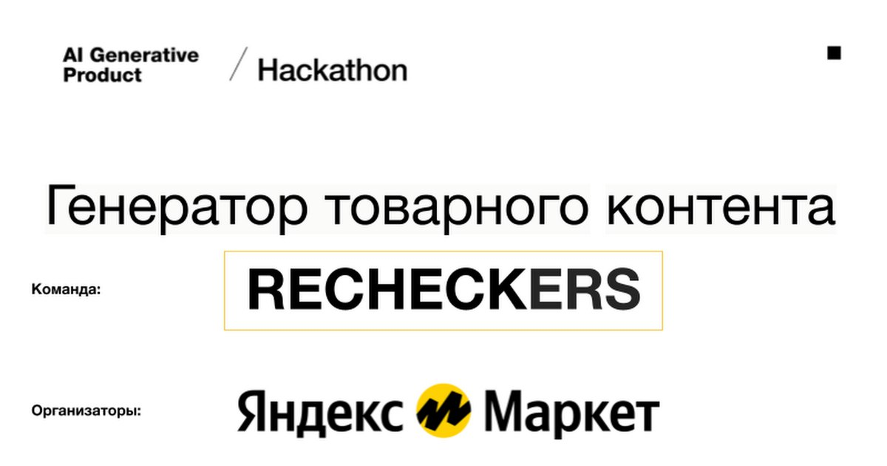
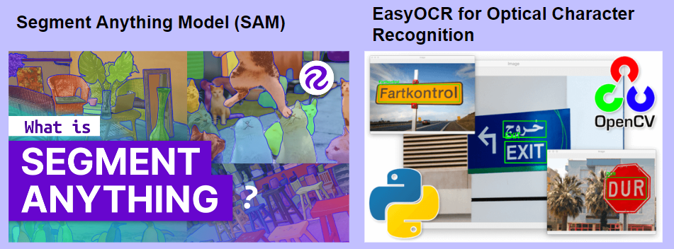
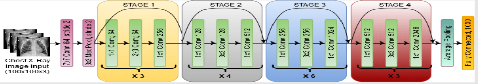
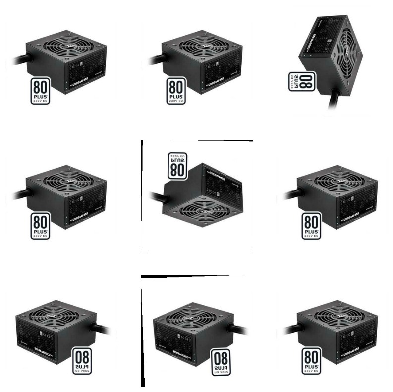
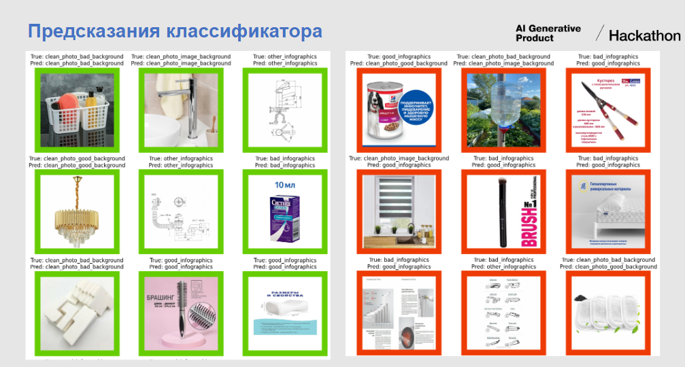

# RECHECKERS_Yandex_Market

# Краткое описание проекта

Решаемые в рамках соревнования задачи:
    <li> Классификация фото по качеству инфографики и фона
    <li> Удаление инфографики с фото
    <li> Размещение товаров на контекстном фоне

## 1. Классификация фото по качеству инфографики и фона
   <li> «хорошая инфографика» (одна или несколько понятных и информативных характеристик товара в текстовом или визуальном оформлении, изображение качественное, понятно, что за товар) - "good_infographics"
   <li> «плохая инфографика» (когда текст без визуального оформления/сложные термины/непонятные символы/только иностранный язык)  -"bad_infographics"
   <li> не относим ни к плохой/ни к хорошей инфографике - "other_infographics"
   <li> «фото без инфографики с хорошим однотонным фоном» -
"clean_photo_good_background"
   <li> «фото без инфографики с плохим фоном» - "clean_photo_bad_background"
   <li> «фото без инфографики с плохим фоном» - "clean_photo_bad_background"

Для извлечения информации из подаваемой картинки используются:
<li> модель для извлечения полей текстов - EasyOCR
<li> модель для детекции и сегментации Segment Anything Model (SAM)
    

Модель клаасификатора построена по аржетиктуре RESNET, но имеет 3 входа

Модель получает с URL после предобработки в генераторе на 3 входа:
<li> картинку 64х64х3
<li> маску пересечений текстов и масок сегментов 64х64х3
<li> логиты от SAM 128x128x3

Проблемы с которыми столкнулись:
<li> Яндекс предоставил датасет на более чемм милион примерв с разметкой. Обучение на таком датасете в рамках соревнования не возможно. Поэтому обучение модели происходило на слкчайных сбалансированных срезах данных.
<li> в полученных данных имеется много битых ссылок на картинки и приходилось это учитывать в генераторе данных
<li> так как загрузка и предобработка от EasyOCR и SAM), то не получается брать много данных и учить много эпох. Поэтому применяем аугментацию

Модель способна глубоко учится, но требует много времени. В целом, предсказания оправданы, так как и сама разметка имеет в семе много неодназначного 

## 2. Удаление инфографики с фото

Тут по сути нужно максимально точно детектировать и сегментировать оснвной товар на фото.
Для решения этой задаче вначале применяется модель **CLIP image to text**. 

С помощью которой получается максимально доступное описание товара для извления масок по контексту следующей моделью 

После получкния текстового описания с помощью детектора на осное DINO и SAM происходит извлечение масок с большей вероятностью

## 3. Размещение товаров на контекстном фоне

Генерация фона происходит по методу Generation In-painting с применением модели Stable Diffusion 
